<div align="center">

# 💤 LazyClaude


**모든 Claude 작업을, 게으르고 우아하게.**

_50+ 개 CLI 명령어 외우지 마세요. 그냥 클릭하세요._

[](./README.md)
[](./README.zh.md)
[](https://www.python.org/downloads/)
[](./LICENSE)
[](./CHANGELOG.md)
[](#-아키텍처)

</div>

LazyClaude 는 **로컬 퍼스트 커맨드 센터** 입니다. `~/.claude/` 디렉토리 전체(에이전트·스킬·훅·플러그인·MCP·세션·프로젝트)를 관리하고, 멀티 AI 프로바이더 오케스트레이션을 위한 **n8n 스타일 워크플로우 엔진**을 제공합니다. 모든 것이 `python3 server.py` 한 줄에 들어있습니다.

**클라우드 업로드 없음. 텔레메트리 없음. 설치할 의존성 없음.** 파이썬 표준 라이브러리와 HTML 한 파일이면 끝입니다.

<sub>`lazygit` / `lazydocker` 에서 영감 — 이번엔 Claude 스택을 위한 "Lazy" 툴입니다.</sub>

### 최근 업데이트

| 버전 | 요점 |
|---|---|
| **v2.36.0** | 📦 **앱 형태로 설치** — PWA(브라우저 "앱 설치" / iOS 홈 화면 추가, 크로스 플랫폼) + 72 KB macOS `.app` 번들(`make install-mac` → Spotlight · Dock · 서버 자동 시작/종료). 매니페스트에 3개 단축 메뉴, dark/light theme-color, maskable 아이콘 포함. |
| **v2.34.0** | 🧑‍✈️ **크루 위저드** — Zapier 식 4-스텝 폼만 채우면 기획자 + 페르소나 N명 + Slack 어드민 게이트 + Obsidian 기록까지 자동 생성. 신규 노드 `slack_approval` (Slack Web API), `obsidian_log`. |
| **v2.33.2** | 🔌 ECC 플러그인 **완전 자동 설치** — 가이드 & 툴 탭에서 원클릭, Claude Code 명령어 입력 불필요 |
| **v2.33.1** | 🧰 가이드 툴킷 관리자 (ECC / CCB 설치·제거) · flyout viewport 수정 · 로그인 게이트 첫 방문만 |
| **v2.33.0** | 🎨 Artifacts Viewer — 4중 보안 미리보기 (sandbox + CSP + postMessage + 정적 필터) |
| **v2.32.0** | 🤝 MCP 서버 모드 — Claude Code 세션에서 LazyClaude 직접 호출 |
| **v2.31.0** | 🛡 Security Scan 탭 — 시크릿 / 위험 훅 / 과도 권한 정적 휴리스틱 검사 |
| **v2.30.0** | 🎓 Learner — 최근 세션 JSONL 에서 반복 툴 시퀀스 자동 추출 |
| **v2.23.0** | 🛡 Webhook `X-Webhook-Secret` 인증 + 출력 경로 화이트리스트 (`~/Downloads` · `~/Documents` · `~/Desktop`) |
| **v2.22.1** | 📸 실 UI 스크린샷 12장 자동 생성 (Playwright) |
| **v2.22.0** | 🛡 HTTP 노드 SSRF 가드 (scheme/host/prefix + DNS rebinding 방어) |
| **v2.20.0** | 💸 **통합 비용 타임라인** — 모든 플레이그라운드 + 워크플로우 실행 비용 한눈에 |
| **v2.19.0** | 📜 워크플로우 **run diff / rerun** — 두 실행을 per-node 비교 |
| **v2.3 ~ v2.9** | 🧊🧠🛠️📦📎👁️🏁 Claude API 플레이그라운드 7탭 (prompt cache · thinking · tool-use · batch · files · vision · model bench) |

---

## 🎬 이렇게 생겼어요

```
┌────────────────────────────────────────────────────────────────┐
│  💤  LazyClaude                                     v2.36.0 🇰🇷│
├────────┬───────────────────────────────────────────────────────┤
│ 🆕 신기능│   🔀 워크플로우                                       │
│ 🏠 메인 │   ┌──────┐      ┌──────┐      ┌──────┐               │
│ 🛠 작업 │   │🚀시작│─────▶│🗂 Claude│─┬──▶│📤 결과│              │
│ ⚙ 설정 │   └──────┘      └──────┘   │  └──────┘               │
│ 🎛 고급 │                  ┌──────┐   │                         │
│ 📈 시스템│                 │🗂 GPT │──┤                         │
│        │                  └──────┘   │                         │
│ 💬 🐙  │                  ┌──────┐   │                         │
│        │                  │🗂 Gemini│┘                         │
│        │                  └──────┘                              │
└────────┴───────────────────────────────────────────────────────┘
```

6 그룹 52 탭 · 16 워크플로우 노드 타입 · 8 AI 프로바이더 · 5 테마 · 3 언어.

### 📸 스크린샷

**메인 + 워크플로우 에디터**

| 개요 (최적화 점수 + 브리핑) | 워크플로우 DAG 에디터 (n8n 스타일) |
|---|---|
| 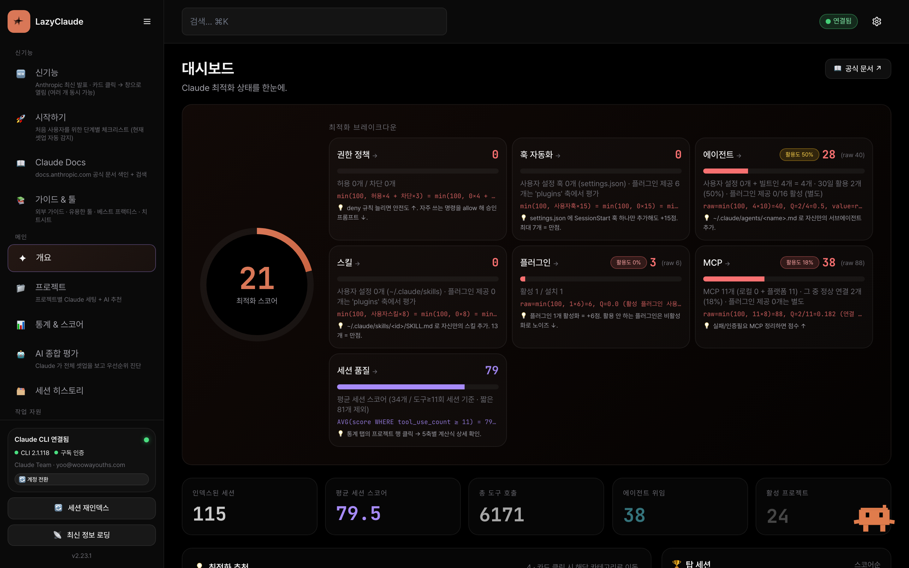 | 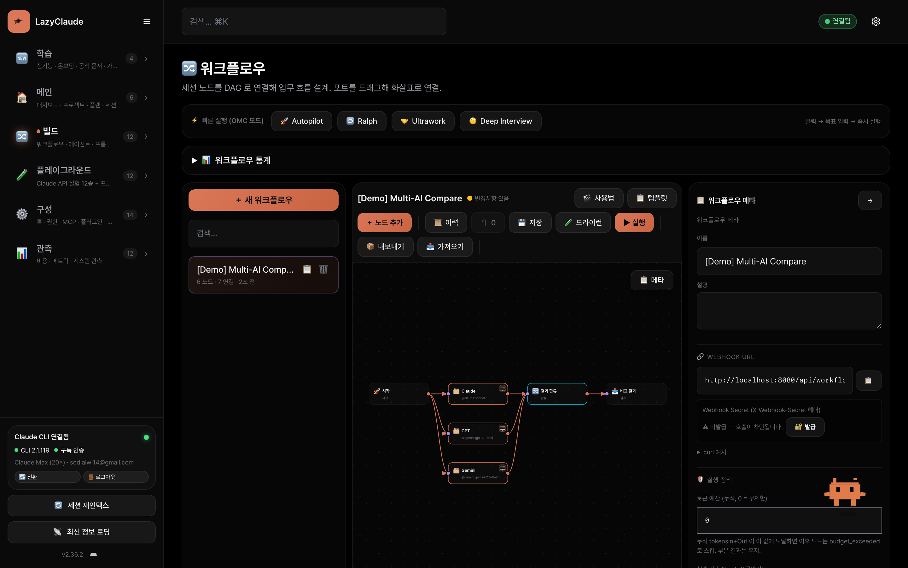 |

**멀티 AI + 통합 비용**

| AI 프로바이더 (Claude/GPT/Gemini/Ollama/Codex) | 비용 타임라인 (플레이그라운드 + 워크플로우 통합) |
|---|---|
| 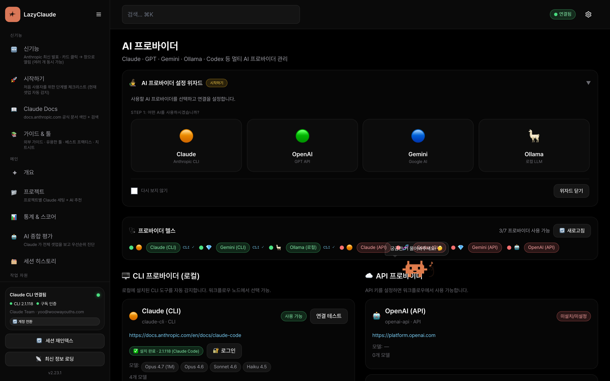 | 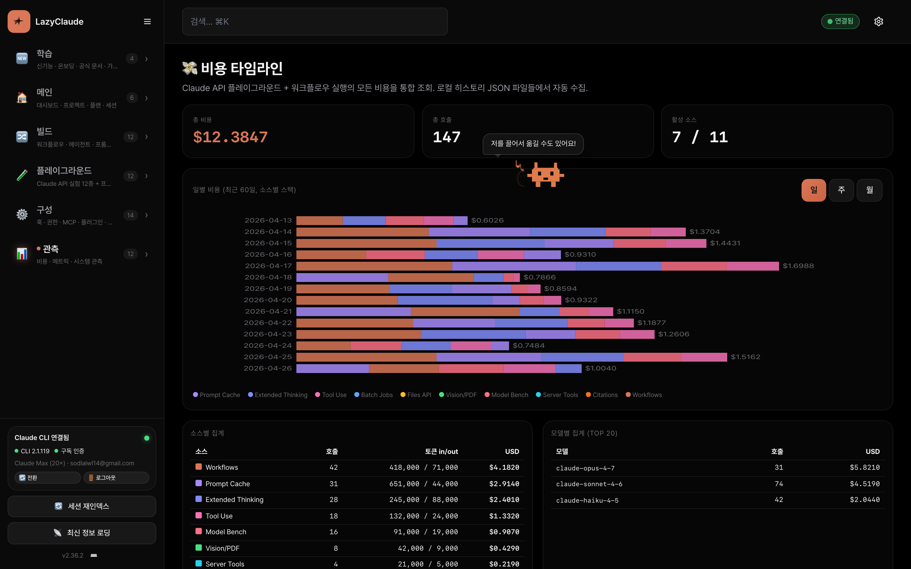 |

**Claude API 플레이그라운드**

| 🧊 Prompt Cache Lab | 🧠 Extended Thinking Lab |
|---|---|
| 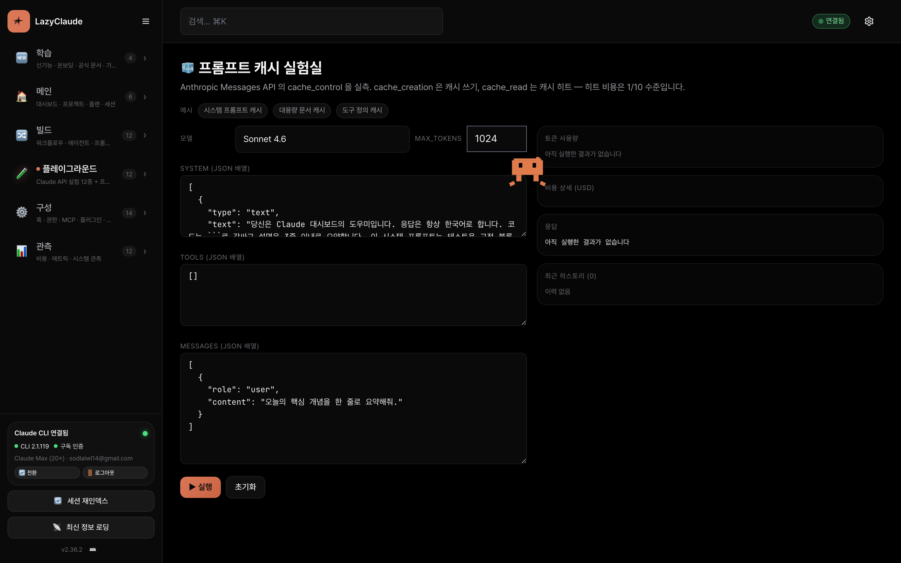 | 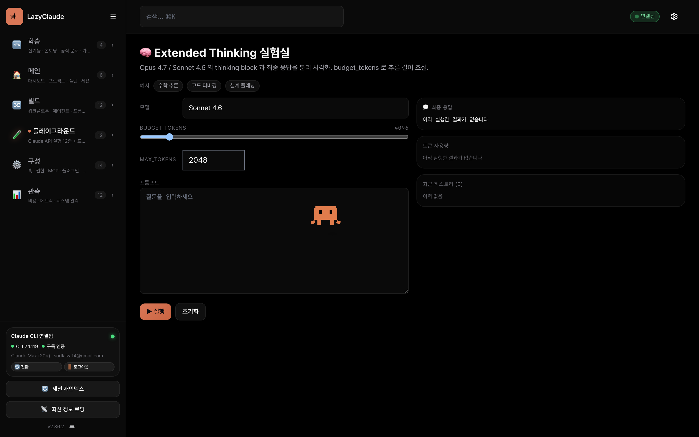 |
| 🛠️ Tool Use 플레이그라운드 | 🏁 모델 벤치마크 |
| 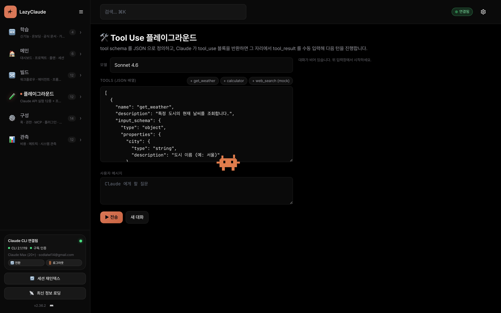 | 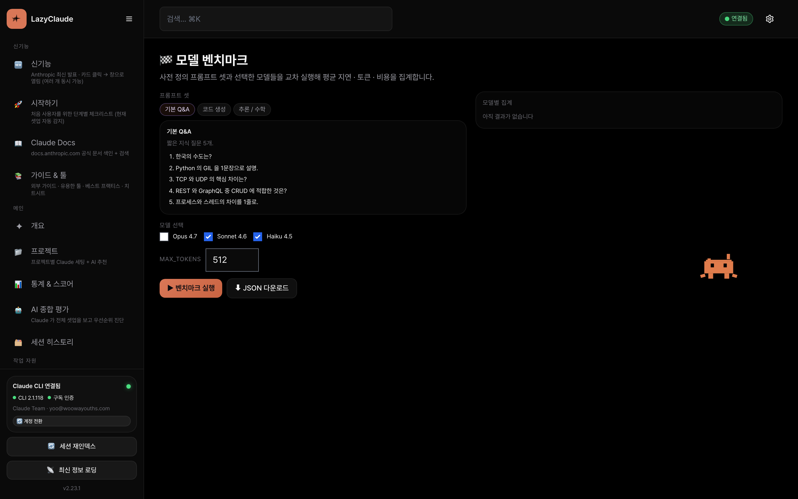 |

**지식 · 재사용**

| 📖 Claude Docs Hub | 📝 프롬프트 라이브러리 |
|---|---|
| 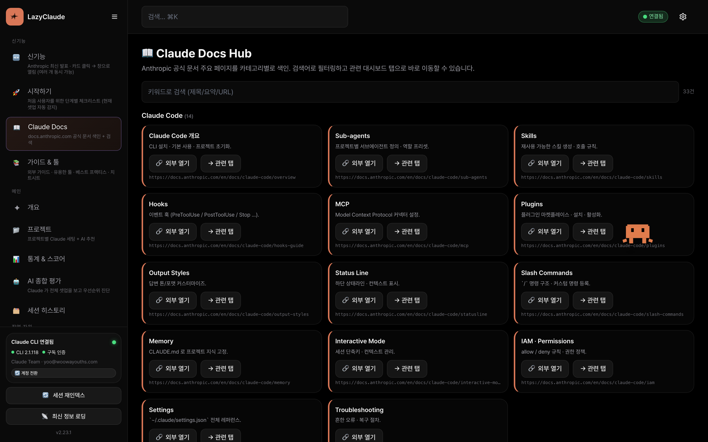 | 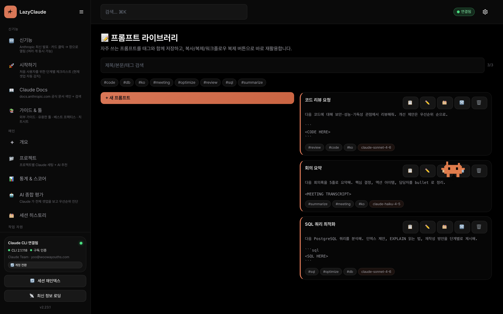 |
| 👥 프로젝트 서브에이전트 | 🔗 MCP 커넥터 |
| 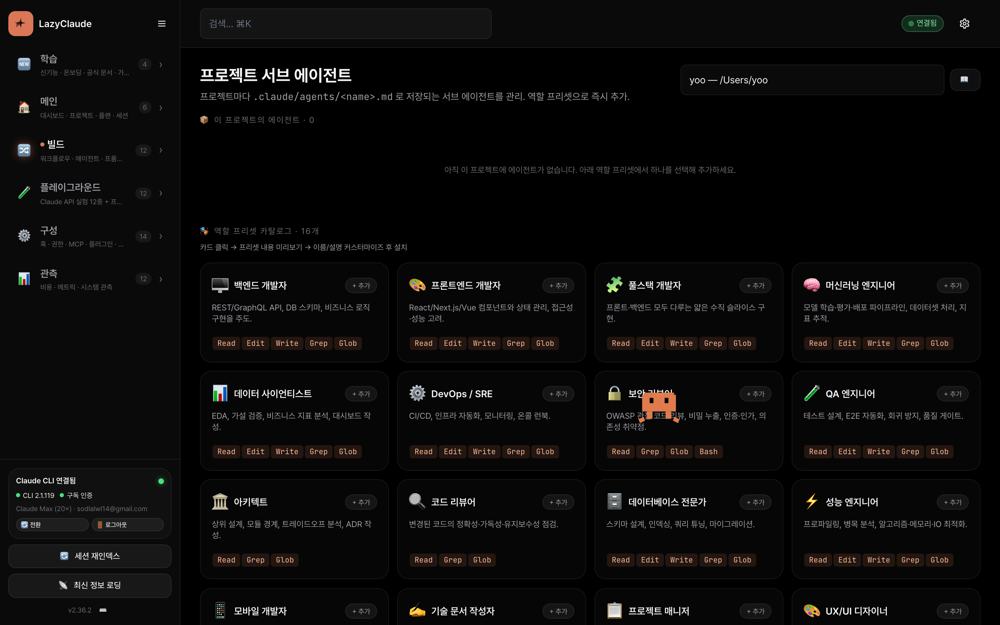 | 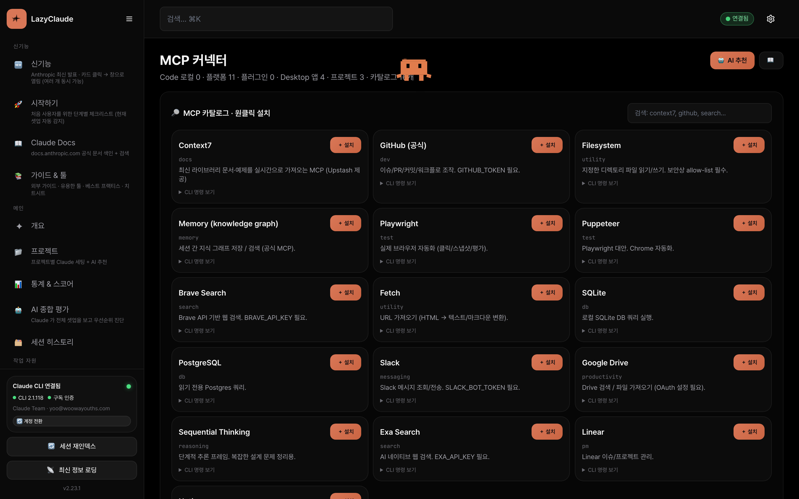 |

**토큰 최적화**

| 🦀 RTK Optimizer (설치 · 활성 · 통계) |
|---|
| 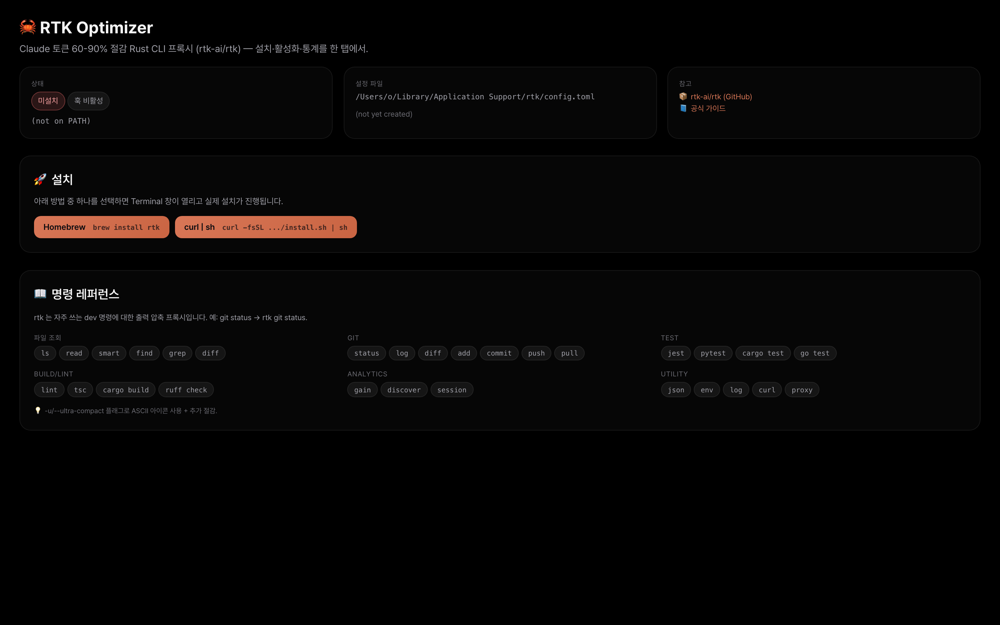 |

_모든 스크린샷은 `scripts/capture-screenshots.mjs` (Playwright · 1440×900 @2x) 로 자동 생성. UI 변경 후 재생성._

---

## ✨ 왜 만들었나요?

이미 Claude Code 를 쓰고 있다면, GPT · Gemini · Ollama · Codex 를 추가하면서 CLI · API 키 · 폴백 로직 · 비용 추적을 직접 관리하고 있을 가능성이 높습니다. 그리고 Claude Code 의 설정 폴더(`~/.claude/`)에는 에이전트 · 스킬 · 훅 · 플러그인 · MCP 서버 · 세션이 쌓이는데 이를 한 번에 보는 방법이 없죠.

**LazyClaude 가 이 두 문제를 한 탭에서 해결합니다.**

| 이전 방식 | Control Center |
|---|---|
| `cat ~/.claude/settings.json` 눈으로 확인 | 52 탭이 각 섹션을 렌더링 |
| `ls ~/.claude/agents/` → 에디터 열기 | 16 역할 프리셋 · 원클릭 생성 |
| 쉘 스크립트로 멀티 AI 비교 | 세션 노드 3개 드래그 → merge → output |
| RAG 파이프라인 수동 구성 | 빌트인 `RAG Pipeline` 템플릿 |
| API 비용은 미궁 속 | 프로바이더별 일별 스택 차트 |
| 한/영 문맥 전환 | 런타임 `ko` / `en` / `zh` 토글 |

---

## 🎯 사용 사례

**개인 개발자** — Claude Code 셋업(에이전트·스킬·슬래시 명령·MCP·세션)을 한곳에서 관리. 16개 역할 프리셋으로 원클릭 서브에이전트 생성.

**팀 리드** — `Lead → Frontend + Backend + Reviewer` 병렬 워크플로우 구성. 실제 Terminal 세션 spawn, `session_id` 로 이어받기, 피드백 노트 자동 주입, N 스프린트 반복 실행.

**AI 연구자** — Claude + GPT + Gemini 에 동일 프롬프트 병렬 전송 → merge → 결과 비교 자동 저장. 또는 `embedding → 벡터 검색(HTTP) → Claude` 5번의 드래그로 RAG 파이프라인 구축.

**자동화 엔지니어** — Webhook(`POST /api/workflows/webhook/{id}`) 으로 GitHub Actions / Zapier 에서 트리거. Cron 으로 매일 자동 실행. 실패 시 재시도, 저렴한 프로바이더로 폴백, 토큰 예산 초과 시 알림.

**Ollama 파워 유저** — 23개 모델 카탈로그 탐색, 원클릭 다운로드, Modelfile 로 커스텀 모델 생성, 기본 채팅/임베딩 모델 지정 — `ollama pull` 명령어 외우지 않아도 됩니다.

---

## 🚀 빠른 시작 (30초)

**1 · 클론**
```bash
git clone https://github.com/cmblir/LazyClaude.git && cd LazyClaude
```

**2 · 실행**
```bash
python3 server.py
```

**3 · 접속**
→ [http://127.0.0.1:8080](http://127.0.0.1:8080)

끝. `pip install`, `npm install`, Docker 모두 불필요. 서버는 파이썬 표준 라이브러리만 사용합니다.

### 사전 요구사항

| 필수 | 권장 | 선택 |
|---|---|---|
| Python 3.10+ | Claude Code CLI — `npm i -g @anthropic-ai/claude-code` | Ollama (자동 시작됨) |
| — | macOS (Terminal.app 세션 spawn 용) | GPT / Gemini / Anthropic API 키 |

### 환경 변수

```bash
HOST=127.0.0.1                       # 바인드 주소 (기본)
PORT=8080                            # 포트 (기본)
CHAT_MODEL=haiku                     # 챗봇 모델: haiku(기본) / sonnet / opus
OLLAMA_HOST=http://localhost:11434   # Ollama 서버
OPENAI_API_KEY=sk-...                # 선택, UI 에서도 설정 가능
GEMINI_API_KEY=AIza...               # 선택
ANTHROPIC_API_KEY=sk-...             # 선택
```

API 키는 `🧠 AI 프로바이더` 탭에서 저장해도 됩니다 — `~/.claude-dashboard-config.json` 에 보관됩니다.

---

## ✨ 주요 기능

### 🧑‍✈️ 크루 위저드 — Zapier 스타일 자동 생성기 (v2.34)

- **4-스텝 폼** — `크루 위저드` 탭에서 폼만 채우면 기획자 + 페르소나 N명 + Slack 어드민 게이트 + Obsidian 기록까지 한 번에 자동 생성
- **자율성 3 모드** — `admin_gate` (Slack 승인 대기) · `autonomous` (짧은 타임아웃 후 스스로 판단) · `no_slack` (로컬만)
- **Slack 자유 답장**은 다음 사이클의 입력으로 사용됨 — 어드민이 흐름 중간에 끼어들어 방향을 조정 가능
- **Obsidian 노드** — 사이클별 보고를 `<vault>/Projects/<프로젝트>/logs/YYYY-MM-DD.md` 에 자동 append
- 생성 결과는 일반 워크플로우 — 캔버스에서 그대로 자유 편집 가능

### 🔀 워크플로우 엔진 (n8n 스타일 DAG)

- **18개 노드 타입**: `start` · `session` · `subagent` · `aggregate` · `branch` · `output` · `http` · `transform` · `variable` · `subworkflow` · `embedding` · `loop` · `retry` · `error_handler` · `merge` · `delay` · `slack_approval` · `obsidian_log`
- **병렬 실행** — 토폴로지 레벨 + ThreadPoolExecutor
- **SSE 스트리밍** — 노드별 실시간 진행률
- **🔁 Repeat** — 최대 횟수 · 간격 · 스케줄 윈도우(`HH:MM~HH:MM`) · 피드백 노트 자동 주입
- **Cron 스케줄러** — 5필드 cron 표현식, 분 단위 정밀도
- **Webhook 트리거** — `POST /api/workflows/webhook/{wfId}` + `X-Webhook-Secret` 헤더 (v2.23 부터 필수 · 에디터에서 발급/교체/제거)
- **Export / Import** — JSON 으로 워크플로우 공유
- **버전 히스토리** — 최근 20개 자동 보관 + 원클릭 복원
- **조건부 실행** — 11종 (contains · equals · regex · length · expression AND/OR ...)
- **변수 스코프** — `{{변수명}}` 템플릿 치환, 글로벌 / 로컬
- **템플릿 8종** — 빌트인 5(멀티 AI 비교 · RAG · 코드 리뷰 · 데이터 ETL · 재시도) + 팀 스타터 3(리드/FE/BE · 리서치 · 병렬×3) + 커스텀 무제한
- **캔버스 UX** — 미니맵 · 노드 검색(하이라이트+dim) · 그룹핑(Shift+클릭) · Ctrl+C/V/Z · `?` 단축키 도움말
- **18장면 인터랙티브 튜토리얼** — typewriter + 커서 애니메이션

### 🧠 멀티 AI 프로바이더

- **8개 빌트인** — Claude CLI · Ollama · Gemini CLI · Codex + OpenAI API · Gemini API · Anthropic API · Ollama API
- **커스텀 CLI 프로바이더** — 임의의 CLI 를 프로바이더로 등록 (chat + embed 명령어)
- **폴백 체인** — 실패 시 자동 전환 (기본: `claude-cli → anthropic-api → openai-api → gemini-api`)
- **Rate Limiter** — 프로바이더별 토큰 버킷 (requests/min)
- **멀티 AI 비교** — 동일 프롬프트 → 여러 프로바이더 → 결과 나란히
- **설정 위자드** — 초보자용 3단계 가이드 (선택 → 설정 → 테스트)
- **헬스 대시보드** — 프로바이더별 실시간 가용성
- **비용 추적** — 프로바이더별 / 워크플로우별 / 일별 스택 차트
- **사용량 알림** — 일일 토큰/비용 임계치 설정 → 브라우저 알림

### 🦙 Ollama 모델 허브 (Open WebUI 스타일)

- **23개 모델 카탈로그** — LLM · Code · Embedding · Vision (llama3.1, qwen2.5, gemma2, deepseek-r1, bge-m3 등)
- **원클릭 pull** — 진행률 바(SSE 폴링) + 삭제 + 모델 정보
- **자동 시작** — 대시보드 기동 시 `ollama serve` 자동 실행
- **기본 모델 지정** — 프로바이더별 채팅/임베딩 기본값
- **Modelfile 편집기** — UI 에서 커스텀 모델 생성

### 🦀 RTK Optimizer — Claude 토큰 60-90% 절감 (v2.24.0)

[`rtk-ai/rtk`](https://github.com/rtk-ai/rtk) — Rust 로 작성된 CLI 프록시로, LLM 이 보기 전에 커맨드 출력을 압축합니다 (그들 벤치에서 중간 규모 TS/Rust 세션이 118K → 24K 토큰으로 감소).

- **원클릭 설치** — Homebrew / `curl | sh` / Cargo, Terminal 창에서 대화형 실행
- **Claude Code 훅 활성화** — 대시보드에서 `rtk init -g` 실행 → `git status` 등 Bash 명령이 자동으로 `rtk git status` 로 감싸짐
- **실시간 절감 통계** — `rtk gain`(누적) + `rtk session`(현재 세션) 을 카드로 렌더, 수동 새로고침
- **설정 파일 뷰어** — `~/Library/Application Support/rtk/config.toml` (macOS) / `~/.config/rtk/config.toml` (Linux)
- **명령 레퍼런스** — 30+ 서브커맨드를 6 카테고리(파일 · Git · Test · Build/Lint · Analytics · Utility)로 그룹핑 + `-u/--ultra-compact` 힌트

### 🤝 Claude Code 통합 (53 탭)

| 그룹 | 탭 |
|---|---|
| 🆕 신기능 | `features` · `onboarding` · `guideHub` · 🆕 `claudeDocs` |
| 🏠 메인 | `overview` · `projects` · `analytics` · `aiEval` · `sessions` |
| 🛠️ 작업 | `workflows` · `aiProviders` · `agents` · `projectAgents` · `skills` · `commands` · `promptCache` · `thinkingLab` · `toolUseLab` · `batchJobs` · `apiFiles` · `visionLab` · `modelBench` · `serverTools` · `citationsLab` · `agentSdkScaffold` · `embeddingLab` · `promptLibrary` · 🆕 `rtk` |
| ⚙️ 설정 | `hooks` · `permissions` · `mcp` · `plugins` · `settings` · `claudemd` |
| 🎛️ 고급 | `outputStyles` · `statusline` · `plans` · `envConfig` · `modelConfig` · `ideStatus` · `marketplaces` · `scheduled` |
| 📈 시스템 | `usage` · `metrics` · `memory` · `tasks` · `backups` · `bashHistory` · `telemetry` · `homunculus` · `team` · `system` |

하이라이트: **16개 서브에이전트 역할 프리셋**, 세션 타임라인 + 품질 스코어링, CLAUDE.md 에디터, MCP 커넥터 설치기, 플러그인 마켓. **Claude API 플레이그라운드 10탭** — 프롬프트 캐시 · Extended Thinking · Tool Use · Batch · Files · Vision/PDF · 모델 벤치 · **hosted server tools (web_search + code_execution)** · **Citations** · **Agent SDK 스캐폴드**. **Docs Hub** — 33개 공식 문서 페이지 색인 + 대시보드 탭 연결.

### 🌍 다국어 지원

- **3개 언어** — 한국어(`ko`, 기본) · 영어(`en`) · 중국어(`zh`)
- **언어당 3,234개 번역 키** · **영문/중문 모드 한글 잔존 0** (검증 완료)
- **런타임 DOM 번역** — MutationObserver (페이지 리로드 없음)
- **`error_key` 시스템** — 백엔드 에러 메시지도 프론트에서 현지화
- **검증 파이프라인** — `scripts/verify-translations.js` 가 4단계 검사 (parity · `t()` · audit · static DOM)

### 🎨 UX & 접근성

- **5개 테마** — Dark · Light · Midnight · Forest · Sunset
- **모바일 반응형** — 사이드바 접기, 모달 풀스크린
- **접근성** — ARIA 레이블, `role="dialog"`, 포커스 트랩, 키보드 네비게이션
- **브라우저 알림** — 워크플로우 완료, 사용량 알림, 시스템 이벤트
- **성능 최적화** — API 캐싱, 디바운스 오토리로드, RAF 배치

---

## 📐 아키텍처

```
claude-dashboard/
├── server.py                     # 엔트리 (포트 충돌 자동 해결 + ollama 자동 시작)
├── server/                       # 14,067줄 · 표준 라이브러리만
│   ├── routes.py                 # 190 API 라우트 (GET + POST + PUT + DELETE + regex webhook)
│   ├── workflows.py              # DAG 엔진 · 16 노드 실행 · Repeat · Cron · Webhook (2,296)
│   ├── ai_providers.py           # 8 프로바이더 · 레지스트리 · Rate Limiter (1,723)
│   ├── ai_keys.py                # 키 관리 · 커스텀 프로바이더 · 비용 추적 (734)
│   ├── ollama_hub.py             # 카탈로그 · pull/delete/create · serve 관리 (606)
│   ├── nav_catalog.py            # 52탭 단일 소스 + i18n 설명
│   ├── features.py               # 기능 탐색 · AI 평가 · 추천
│   ├── projects.py               # 프로젝트 브라우저 · 16 서브에이전트 역할 프리셋
│   ├── sessions.py               # 세션 인덱싱 · 품질 스코어링 · 에이전트 그래프
│   ├── system.py                 # usage · memory · tasks · metrics · backups · telemetry
│   ├── errors.py                 # i18n 에러 키 시스템 (49 키)
│   └── …                         # 총 20 모듈
├── dist/
│   ├── index.html                # 단일 파일 SPA (~13,500줄)
│   └── locales/{ko,en,zh}.json   # 3,234 키 × 3 언어
├── tools/
│   ├── translations_manual_*.py  # 수동 번역 override
│   ├── extract_ko_strings.py     # 한국어 문자열 추출
│   ├── build_locales.py          # ko/en/zh JSON 빌드
│   └── i18n_audit.mjs            # Node 측 감사
├── scripts/
│   ├── verify-translations.js    # 4단계 i18n 검증
│   └── translate-refresh.sh      # 원샷 파이프라인
├── VERSION · CHANGELOG.md
└── README.md · README.ko.md · README.zh.md
```

### 데이터 저장소 (모두 `$HOME`, env var 로 override 가능)

| 파일 | 내용 |
|---|---|
| `~/.claude-dashboard-workflows.json` | 워크플로우 + 실행 이력 + 커스텀 템플릿 + 버전 히스토리 + 비용 |
| `~/.claude-dashboard-config.json` | API 키 · 커스텀 프로바이더 · 기본 모델 · 폴백 체인 · 사용량 임계치 |
| `~/.claude-dashboard-translations.json` | AI 번역 캐시 |
| `~/.claude-dashboard.db` | SQLite 세션 인덱스 |
| `~/.claude-dashboard-mcp-cache.json` | MCP 카탈로그 캐시 |
| `~/.claude-dashboard-ai-evaluation.json` | AI 평가 캐시 |

원자적 쓰기: `server/utils.py::_safe_write` (`.tmp → rename`), 동시성 안전을 위한 threading lock.

### 기술 스택

| 레이어 | 기술 |
|---|---|
| 백엔드 | Python 표준 라이브러리 `ThreadingHTTPServer` (의존성 0) |
| 데이터베이스 | SQLite WAL 모드 |
| 프론트엔드 | 단일 HTML + Tailwind CDN + Chart.js + vis-network |
| i18n | 런타임 JSON fetch + MutationObserver DOM 번역 |
| 워크플로우 | 토폴로지 DAG 정렬 + `concurrent.futures.ThreadPoolExecutor` |
| 챗봇 | 동적 시스템 프롬프트 (매 요청마다 VERSION + CHANGELOG + nav_catalog 읽음) |

---

## 🔢 통계 (v2.36.0)

| 지표 | 값 |
|---|---|
| 백엔드 코드 | ~18,000줄 · 46 모듈 · stdlib only |
| 프론트엔드 코드 | ~16,600줄 · 단일 HTML |
| API 라우트 | **190** (GET 102 / POST 85 / PUT 3 + regex webhook) |
| 탭 수 | **52** (6 그룹) |
| 워크플로우 노드 타입 | **16** |
| AI 프로바이더 | **8** 빌트인 + 커스텀 무제한 |
| Claude API 플레이그라운드 탭 | **11** (프롬프트 캐시 · Extended Thinking · Tool Use · Batch · Files · Vision · 모델 벤치 · Server Tools · Citations · Agent SDK 스캐폴드 · Embedding Lab) |
| 통합 비용 타임라인 | ✓ (모든 플레이그라운드 + 워크플로우, 일별 스택) |
| 워크플로우 run diff / rerun | ✓ (per-node Δ) |
| Prompt Library | ✓ (태그 검색 + 워크플로우로 복제) |
| Batch 비용 가드 | ✓ (Batch 당 USD/토큰 임계치) |
| 공식 문서 색인 | **33** 페이지 |
| Ollama 카탈로그 | **23** 모델 |
| 서브에이전트 역할 프리셋 | **16** |
| 빌트인 워크플로우 템플릿 | **8** (빌트인 5 + 팀 3) |
| i18n 키 | **3,234** × 3 언어 · 누락 0 |
| 테마 | **5** |
| 튜토리얼 장면 | **18** |
| E2E 테스트 스크립트 | **3** (tabs smoke · workflow · ui elements) |

---

## 🛠️ 트러블슈팅

| 문제 | 해결 |
|---|---|
| 포트 8080 이 이미 사용 중 | `PORT=8090 python3 server.py` (서버가 기존 프로세스 종료 여부도 물어봄) |
| `claude` 명령 찾을 수 없음 | Claude Code CLI 설치: `npm i -g @anthropic-ai/claude-code` |
| Ollama 연결 실패 | `OLLAMA_HOST` 확인 (기본 `http://localhost:11434`), 또는 대시보드가 자동 시작하도록 둠 |
| macOS 세션 spawn 실패 | 시스템 설정 → 개인 정보 보호 → 자동화 에서 Terminal 권한 허용 |
| 영문 모드에 한글이 보임 | `scripts/translate-refresh.sh` 실행 (locales 재빌드 + 검증) |
| 챗봇이 "이 기능은 몰라요" 응답 | 챗봇은 `VERSION` + `CHANGELOG.md` + `nav_catalog.py` 를 실시간으로 읽음 — 기능 추가 시 이 3 파일을 함께 갱신 |

---

## 🎭 E2E 테스트 (Playwright)

Playwright 는 devDependency 로 이미 포함. 최초 1회 브라우저 설치:

```bash
npx playwright install chromium
```

대시보드 서버가 실행 중인 상태에서 (`python3 server.py`):

```bash
npm run test:e2e:smoke       # 52 탭 — 뷰 렌더 실패 / console error 검출
npm run test:e2e:workflow    # 빌트인 템플릿 생성 → 실행 → 배너 등장 관찰
npm run test:e2e:headed      # 브라우저 창 띄워서 실행
TAB_ID=workflows npm run test:e2e:smoke   # 단일 탭만
```

스크립트: `scripts/e2e-*.mjs`. 의존성 없이 `127.0.0.1:8080` 라이브 서버를 대상으로 동작.

---

## 🤝 기여하기

LazyClaude 는 1인 메인테이너 개인 프로젝트이지만, 이슈와 PR 모두 환영합니다: [github.com/cmblir/LazyClaude](https://github.com/cmblir/LazyClaude).

오탈자·i18n 누락·자명한 버그는 바로 PR 보내주세요. 큰 기능/리팩터링은 중복 작업 방지를 위해 이슈 먼저 열어주시면 좋습니다.

### 새 탭 추가 (7 단계)

1. `dist/index.html::NAV` 에 엔트리 추가
2. `dist/index.html::VIEWS.<id>` 렌더러 구현
3. `server/nav_catalog.py::TAB_CATALOG` 에 `(id, group, desc, keywords)` 추가
4. `TAB_DESC_I18N` 에 `en` / `zh` 설명 추가
5. (필요 시) `server/routes.py` 에 백엔드 라우트 + `server/` 하위 모듈 구현
6. 새 UI 문자열을 `tools/translations_manual_9.py` 에 등록
7. `python3 tools/extract_ko_strings.py && (cd tools && python3 build_locales.py) && node scripts/verify-translations.js` 실행

### 번역 기여

[`TRANSLATION_CONTRIBUTING.md`](./TRANSLATION_CONTRIBUTING.md) 와 [`TRANSLATION_MIGRATION.md`](./TRANSLATION_MIGRATION.md) 참조. 모든 UI 문자열은 ko / en / zh 3종에 존재해야 하며, `verify-translations.js` 가 누락을 차단합니다.

### 버전 규칙

- `MAJOR` — 워크플로우/스키마 파괴적 변경
- `MINOR` — 신규 탭 또는 주요 기능 (하위 호환)
- `PATCH` — 버그 수정, UI 미세 조정, i18n 보강

기능 변경 시 `VERSION` + `CHANGELOG.md` + `git tag -a vX.Y.Z` 3종 함께 갱신.

---

## 📝 라이선스

[MIT](./LICENSE) — 개인/상업 사용 무료. 출처 표기 환영 (필수는 아님).

---

## 🙏 감사의 말

- [Anthropic Claude Code](https://claude.com/claude-code) — 이 대시보드가 감싸는 CLI
- [n8n](https://n8n.io) — 워크플로우 에디터 영감
- [Open WebUI](https://openwebui.com) — Ollama 모델 허브 영감
- [lazygit](https://github.com/jesseduffield/lazygit) / [lazydocker](https://github.com/jesseduffield/lazydocker) — 이 프로젝트에 이름을 준 "lazy" 정신
- 오픈소스 LLM 생태계의 모든 기여자 분들 🧠

<div align="center"><sub>타이핑보다 클릭을 사랑하는 사람들을 위해 💤 만들었습니다.</sub></div>
