<div align="center">

# 💤 LazyClaude


**你的 Claude 全家桶，一个标签页搞定。**

_别死记 50+ CLI 命令，点一下就行。_

[](./README.md)
[](./README.ko.md)
[](https://www.python.org/downloads/)
[](./LICENSE)
[](./CHANGELOG.md)
[](#-架构)

</div>

LazyClaude 是一款**本地优先的指挥中心**，统一管理你的整个 `~/.claude/` 目录（代理、技能、钩子、插件、MCP、会话、项目），并内置一个强大的 **n8n 风格工作流引擎** 用于多 AI 供应商编排——全部包含在一行 `python3 server.py` 中。

**无云端上传。无遥测。无需安装任何依赖。** 只需 Python 标准库和一个 HTML 文件。

<sub>灵感来自 `lazygit` / `lazydocker`——这次是为 Claude 技术栈而生的 "Lazy" 工具。</sub>

### 近期更新

| 版本 | 重点 |
|---|---|
| **v2.45.1** | 🚀 **性能热修复** — `/api/ccr/status` 原本顺序执行 4 个 subprocess（node/ccr/claude `--version` + `lsof` LISTEN）耗时 ~700 ms。现通过 `ThreadPoolExecutor(4)` fan-out — 实测 **~700 ms → ~340 ms（≈50% 缩短）**。`/api/sessions-monitor/list` 的 per-pid `ps` 合并为单次 `ps -p pid1,pid2,…` 批量调用 — N→1 subprocess，多个 Claude Code 实例同时运行时呈线性加速。|
| **v2.45.0** | 🛣️ **`zclaude` 设置向导 (claude-code-router)** — `config` 分组新增标签。通过 `@musistudio/claude-code-router` 将 Claude Code 路由到 Z.AI/DeepSeek/OpenRouter/Ollama/Gemini 等，五步向导：安装状态（node ≥20、`ccr`、`claude`、配置、3456 端口 LISTEN）→ Providers 表单（一键预设 5 种）→ Router 规则（default/background/think/longContext/webSearch，提供者×模型下拉）→ 服务 Start/Stop/Restart → shell alias 复制块（`alias zclaude='ccr code'`）。仪表板**绝不自动修改 `~/.zshrc`** — 由用户复制粘贴。后端仅使用 stdlib，原子写入 + `chmod 600`，CCR v2.0.0 schema 校验，`$HOME` 沙箱。 |
| **v2.44.1** | 🪢 **multiAssignee 并行 fan-out + 键控画布 diff** — 处理 v2.44.0 推迟的两项。session/subagent 检查器的单一 assignee 选择器替换为重复行构建器（`+ 어시니 추가`）— 当 ≥2 行时通过 `ProviderRegistry.execute_parallel`（openclaw 风格：ThreadPoolExecutor + as_completed 首个成功，取消其余）发起 fan-out。单 assignee 节点行为不变。`_wfRenderCanvas` 重写为键控 diff 渲染器（`__wf._nodeEls` Map + 每节点 JSON 快照）— 仅替换变更节点，未变节点保持 element identity，使 `data-status` 写入、拖拽 transform、选择 class 在后续渲染中存活。边仍通过 `innerHTML` 重建（数量少，依赖节点位置）。画布完全使用 `<svg>#wfSvg` 上的事件委派，无需重新绑定处理器。 |
| **v2.44.0** | 🖥️ **开放端口 / CLI 会话 / 内存监视器 + 工作流性能** — `observe` 分组新增 3 个标签：基于 `lsof` 的 TCP/UDP 监听端口 + 绑定进程 + 一键终止（`pid<500` / 自身 pid 守卫）；活动 Claude Code/CLI 会话 + RSS/空闲时间 + "打开终端" + 终止；内存快照（总/用/空闲/交换进度条）+ Top-30 RSS 表 + "批量终止空闲 Claude Code" 扫描。工作流引擎：并行 worker 4 → `min(32, cpu*2)`，拖拽补丁绕过完整 sanitize，拓扑排序记忆化，per-node 状态写入移至内存 `_RUNS_CACHE`（仅在边界写盘）。新增 openclaw 风格的后端 `execute_parallel`（首个成功），UI 接线留至 v2.44.1。检查器在选择未变更时 early-exit，webhook secret 按工作流缓存。 |
| **v2.43.2** | 📊 **按项目/会话的 token 钻取** — 使用量标签的"按项目统计 token"原本仅显示 TOP 20 只读行。现在所有项目都以可滚动、**可点击**的列表呈现。点击行 → 弹窗显示该项目的 token 总计（输入/输出/缓存分项）、按 token 排序的会话表格、工具/代理分布条、按日期的时间线。每行会话点击跳转到现有的会话详情弹窗。新增 `GET /api/usage/project?cwd=...`（`$HOME` 沙箱）。 |
| **v2.43.1** | 🚀 **性能 — 工作流画布 + 技能/命令列表** — 技能/命令标签每次访问都要扫描+解析 1.4 MB（816 ms / 1116 ms），首屏被阻塞。现在后端 TTL+mtime 缓存，warm 访问提速 ~22× / ~31×。工作流画布拖拽时 `_wfRenderMinimap` 在每次 mousemove（~100/s）同步触发并执行 O(N×E) edge 查找 — 现合并到每帧 1 次 rAF，拖拽期间使用缓存 Map 将查找降至 O(deg)。 |
| **v2.43.0** | 🛠️ **设置助手 — 全局 ↔ 项目范围** — CLAUDE.md / Settings / 技能 / 命令 / 钩子 等所有设置标签新增 🌐 全局 / 📁 项目 切换 + 项目选择器。项目模式读写 `<cwd>/CLAUDE.md` · `<cwd>/.claude/settings.json` · `<cwd>/.claude/settings.local.json` (建议加入 gitignore 的个人覆盖) · `<cwd>/.claude/skills/<id>/SKILL.md` · `<cwd>/.claude/commands/**/*.md`。新增 14 个端点，全部沙箱在 `$HOME` 下，权限规则通过现有全局 sanitize 流程。 |
| **v2.42.3** | 🩹 **钩子标签 2 秒加载 → 瞬时 + 删除真正生效** — 钩子标签首屏被 90 MB jsonl 扫描（1.94 s）阻塞，且 `deleteHook` 缺少重渲染调用导致卡片不消失，两个 bug 同时出现。现在 `/api/hooks/recent-blocks` 改为 TTL+mtime 缓存（cold 0.97 s → warm 0.026 s，37×）并在首屏后通过 `_renderRecentBlocksPanel` 注入懒加载。删除（插件 + 用户路径）成功时调用 `renderView()`，卡片立即消失。 |
| **v2.42.2** | 🖥️ **工作流节点 spawn → 对应 AI CLI** — 点击 `@gemini:gemini-2.5-pro` 节点的 🖥️ 现在打开 **Gemini CLI**，`@ollama:llama3.1` 打开 **`ollama run llama3.1`**，`@codex:o4-mini` 打开 **codex**。此前无视 assignee 始终启动 Claude。所请求的 CLI 未安装时回退到 claude 并提示警告 toast。提示词以横幅输出，保持交互式 REPL。 |
| **v2.42.1** | 🔄 **工作流运行可视化** — 列表卡片内联展示最近 3 次运行状态芯片（✅/❌/⏳）、进行中脉冲徽章（`● 运行中`）、`(N 次)` 总运行次数。重新打开画布时自动恢复最近一次运行状态 — 进行中则启动实时轮询，已结束则一次性 hydrate 节点颜色。后端 `api_workflows_list` 新增 `lastRuns`/`runningCount`/`activeRunId`/`totalRuns`。 |
| **v2.42.0** | 🖱️🧩🧭🔁 **Anthropic 4 项功能一次发布** — Computer Use Lab (`computer-use-2025-01-24` beta · 仅计划), Memory Lab (`memory-2025-08-18` beta · 服务器端 memory blocks), Advisor Lab (Executor + Advisor 配对 · 成本/质量差异), Claude Code Routines 完整 CRUD + 立即运行。14 个新端点，4 个新 playground 标签页。 |
| **v2.41.0** | 👥 **代理团队 + 🤝 最近子代理活动** — 将常用代理打包为可复用的团队（`Frontend Crew = ui-designer + frontend-dev + code-reviewer`），🚀 启动 一键输出每个成员的 `claude /agents <name>` 命令。项目详情模态框新增"最近子代理活动"时间线 — 按源会话分组展示每个会话委派给子代理的工作，点击 🖥 CLI 按钮即可在 Terminal.app 中恢复对应会话。 |
| **v2.40.5** | 🩹 **热修复** — Recent Blocks / Detective 芯片无法点击：内联 `onclick="state.data.hooksFilter=${JSON.stringify(id)};…"` 中的双引号与 attribute 引号冲突，导致解析器截断处理器。现改用 `data-hook-id="…"` + 共享的 `_jumpToHookCard()` 辅助函数。点击 → 应用筛选 + 卡片脉冲。 |
| **v2.40.4** | 🔬 **Hook Detective + 🚨 近期拦截 + 🧬 调度链解码器** — 粘贴钩子拦截错误消息 → 自动提取 hook id 芯片 → 点击跳转到对应卡片并脉冲高亮。后端挖掘最近 60 个 jsonl 文字记录，呈现"近期被拦截的钩子"频率面板。每个卡片都有 🔬 详情模态框 — 将 `node -e "..."` 包装器解码为 `node → runner → hook id → handler → flags` 链。 |
| **v2.40.3** | 🏷️ **钩子名称显示** — 插件 hooks.json 在组级别保存 `id` / `name`（如 `pre:bash:dispatcher`），仪表板现在将其传播到每个子钩子条目并以 mono 大字体作为卡片主标题显示。与 Claude Code `/hooks` 相同的标识符。按 id 搜索即时生效 — 输入 `pre:bash:dispatcher` → 1 个卡片。 |
| **v2.40.2** | 🚨 **钩子标签紧急 UX** — 搜索 · 范围/事件芯片 · "仅危险钩子" 过滤 · 每个 PreToolUse + Edit/Write/Bash 卡片显示 🚨 芯片 · 一键"批量禁用危险钩子"，同时处理用户 `settings.json` 与所有插件 `hooks.json`。专为安装了 100+ 插件钩子、找不到阻塞工作的那一个而设计。 |
| **v2.40.1** | 🚀 **性能热修复** — `dist/index.html` 下载从 1.12 MB 降到 270 KB（服务端 gzip + mtime 缓存），Chart.js / vis-network / marked 改为 `defer` 加载使首屏渲染不再被约 600 KB 的 CDN 脚本解析阻塞，GET 请求 in-flight 去重将并发请求减半，侧栏重新渲染合并到下一个动画帧。无行为变更。 |
| **v2.40.0** | ⚡ **Hyper Agent → 项目级子代理** + 🧭 **侧栏发现优化**（收藏 + 最近 + `/`）。Hyper 开关现在适用于 `<cwd>/.claude/agents/<name>.md`，复合 key 命名空间让同名的全局代理和项目代理各自保留独立的元数据、目标和历史。侧栏新增置顶的 ★ 收藏区块（悬停时切换）、🕒 最近 MRU（自动从 `go()` 调用收集，由 prefs 设置上限）、`/` 单键直接打开现有的 Cmd-K Spotlight — 不重组分类，只缩短到达路径。 |
| **v2.39.0** | ⚡ **Hyper Agent** — 子代理自我精炼。每个可写全局代理卡片上提供独立开关。设置目标 + 精炼范围（systemPrompt / tools / description）+ 触发器（manual / interval / after_session / any），元 LLM（默认 Opus）提出精准修改方案 — 配合 `.bak.md` 备份原子化应用，每次迭代可一键回滚。预算上限、dry-run 预览、可展开的 diff 查看器、历史时间线。 |
| **v2.38.0** | ⚡ **快速设置** — 用一个键盘可达的抽屉（`⌘,` / `Ctrl+,`）切换所有仪表板参数。UI · AI · Behavior · Workflow 四个分区，共 33 个键（effort、temperature、强调色、密度、字体大小、减少动效、遥测刷新、autoResume、吉祥物等）。基于架构的控件（开关 / 分段 / 下拉 / 滑块 / 文本）、服务器端严格校验、`~/.claude-dashboard-prefs.json` 原子化持久化。 |
| **v2.37.0** | 🔄 **Auto-Resume** — 向运行中的 Claude 会话注入自愈重试循环。后台工作进程对退出原因(速率限制 / 上下文超限 / 认证过期 / 未知)分类、解析精确重置时间、用 `claude --resume <id>` 指数退避、快照哈希停滞检测、项目级 Stop+SessionStart 钩子自动安装。会话详情模态框中提供面板,会话列表显示 🔄 AR 徽章。 |
| **v2.33.2** | 🔌 ECC 插件 **全自动安装** — 在"指南与工具"标签页一键完成，无需输入 Claude Code 命令 |
| **v2.33.1** | 🧰 指南工具包管理（ECC / CCB 安装·移除）· flyout 视口修复 · 登录门首次访问仅一次 |
| **v2.33.0** | 🎨 Artifacts Viewer —— 4 层安全预览（sandbox + CSP + postMessage + 静态过滤） |
| **v2.32.0** | 🤝 MCP 服务器模式 —— 在 Claude Code 会话中直接调用 LazyClaude |
| **v2.31.0** | 🛡 Security Scan 标签 —— 静态启发式检测密钥 / 危险钩子 / 过度权限 |
| **v2.30.0** | 🎓 Learner —— 从最近会话 JSONL 自动提取重复工具序列 |
| **v2.23.0** | 🛡 Webhook `X-Webhook-Secret` 鉴权 + 输出路径白名单 (`~/Downloads` · `~/Documents` · `~/Desktop`) |
| **v2.22.1** | 📸 Playwright 自动生成 12 张真实 UI 截图 |
| **v2.22.0** | 🛡 HTTP 节点 SSRF 防护 (scheme/host/prefix + DNS rebinding 防御) |
| **v2.20.0** | 💸 **统一费用时间线**——所有实验室 + 工作流运行费用一览 |
| **v2.19.0** | 📜 工作流 **run diff / rerun**——逐节点对比两次执行 |
| **v2.3 ~ v2.9** | 🧊🧠🛠️📦📎👁️🏁 Claude API 实验室 7 个标签（prompt cache · thinking · tool-use · batch · files · vision · model bench） |

---

## 🎬 界面预览

```
┌────────────────────────────────────────────────────────────────┐
│  💤  LazyClaude                                     v2.33.2 🇨🇳│
├────────┬───────────────────────────────────────────────────────┤
│ 🆕 新功能│   🔀 工作流                                          │
│ 🏠 主要 │   ┌──────┐      ┌──────┐      ┌──────┐               │
│ 🛠 工作 │   │🚀开始│─────▶│🗂 Claude│─┬──▶│📤 输出│              │
│ ⚙ 配置 │   └──────┘      └──────┘   │  └──────┘                │
│ 🎛 高级 │                  ┌──────┐   │                         │
│ 📈 系统 │                  │🗂 GPT │──┤                         │
│        │                  └──────┘   │                         │
│ 💬 🐙  │                  ┌──────┐   │                         │
│        │                  │🗂 Gemini│┘                         │
│        │                  └──────┘                              │
└────────┴───────────────────────────────────────────────────────┘
```

6 组 52 个标签页 · 16 种工作流节点 · 8 个 AI 供应商 · 5 种主题 · 3 种语言。

### 📸 截图

**主页 + 工作流编辑器**

| 概览（优化评分 + 简报） | 工作流 DAG 编辑器（n8n 风格） |
|---|---|
| 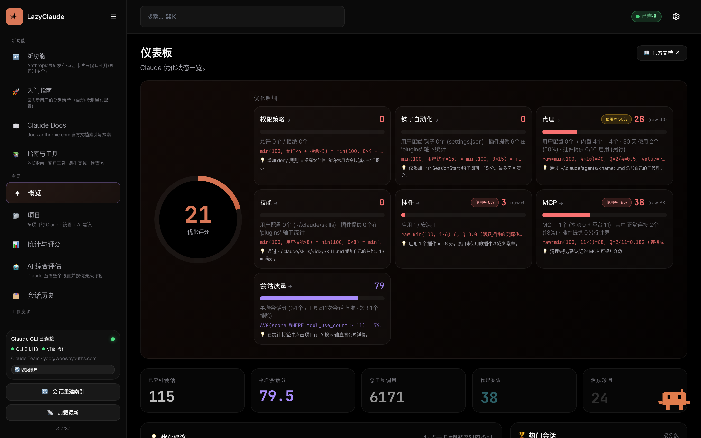 | 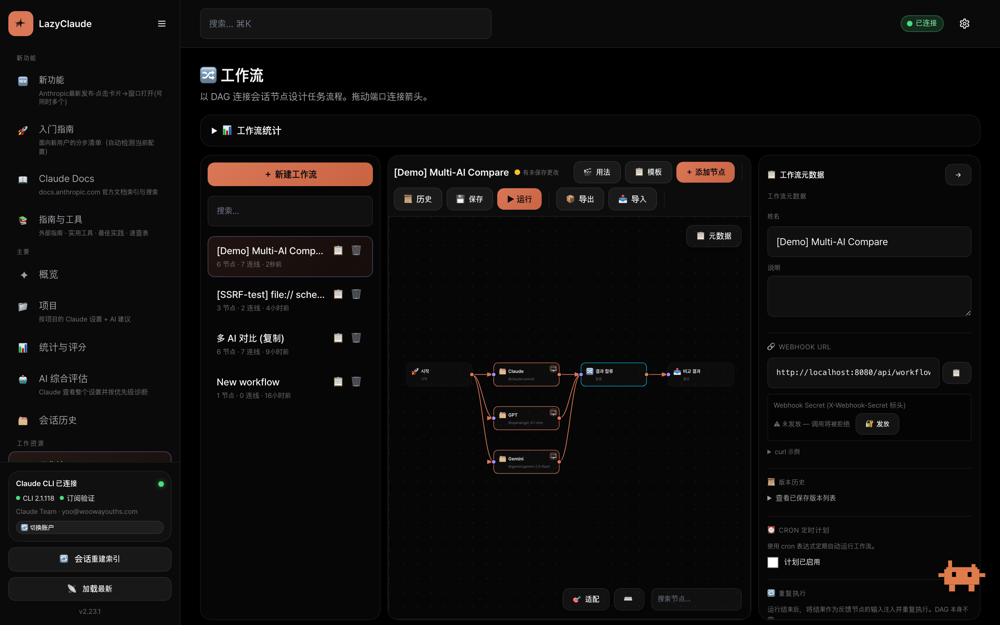 |

**多 AI + 统一费用**

| AI 供应商（Claude/GPT/Gemini/Ollama/Codex） | 费用时间线（所有实验室 + 工作流统一） |
|---|---|
| 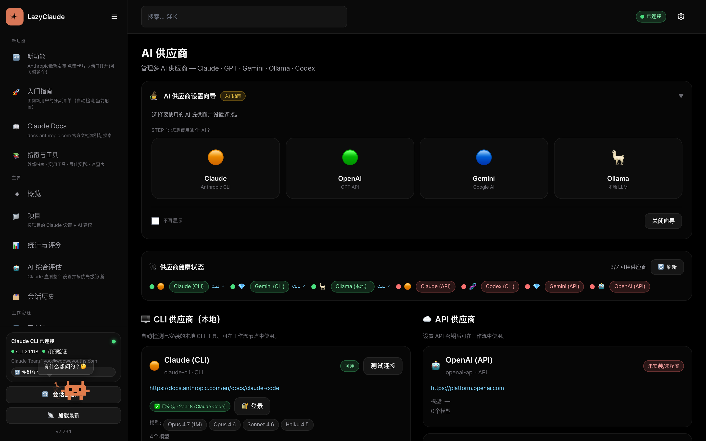 | 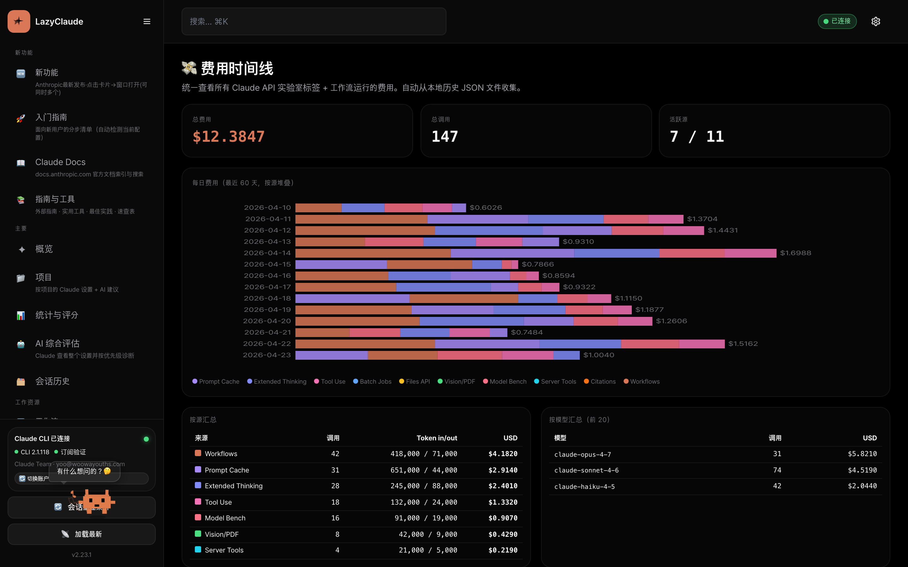 |

**Claude API 实验室**

| 🧊 提示缓存实验室 | 🧠 扩展思维实验室 |
|---|---|
| 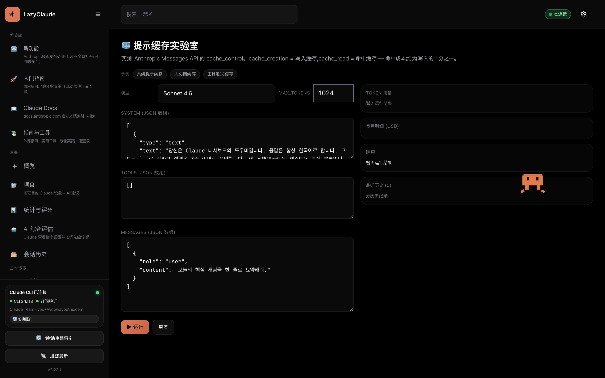 | 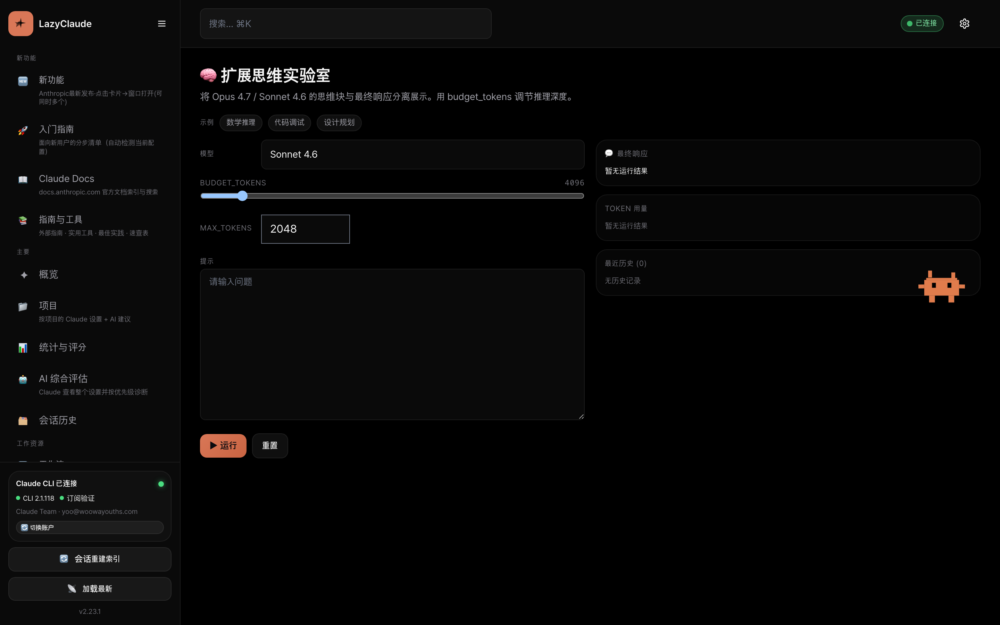 |
| 🛠️ 工具使用实验室 | 🏁 模型基准测试 |
| 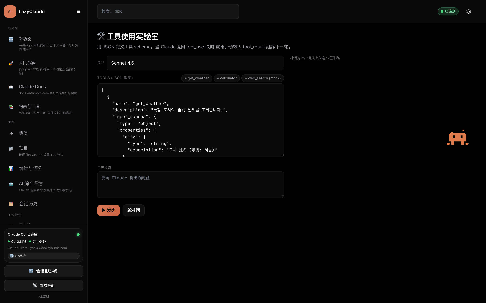 | 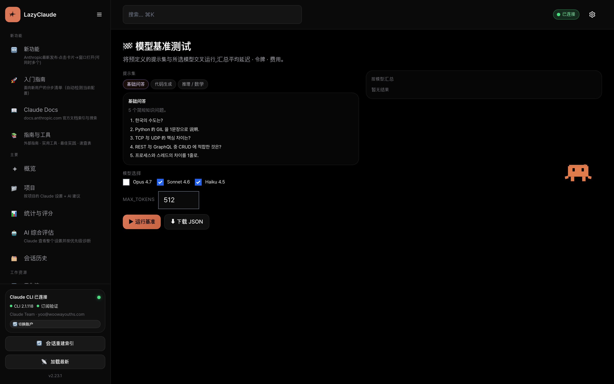 |

**知识 · 复用**

| 📖 Claude 文档中心 | 📝 提示库 |
|---|---|
| 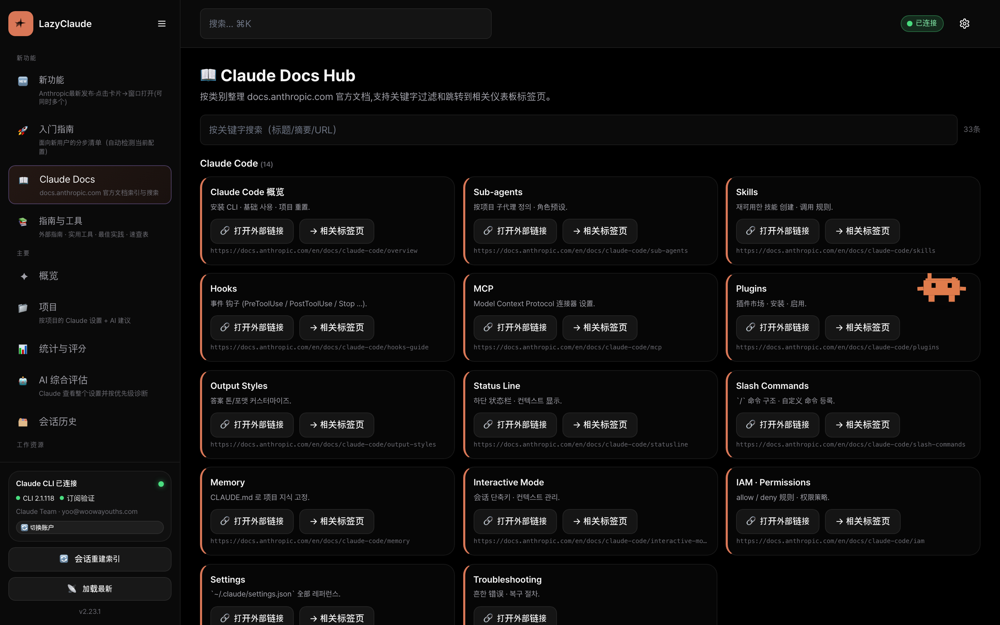 | 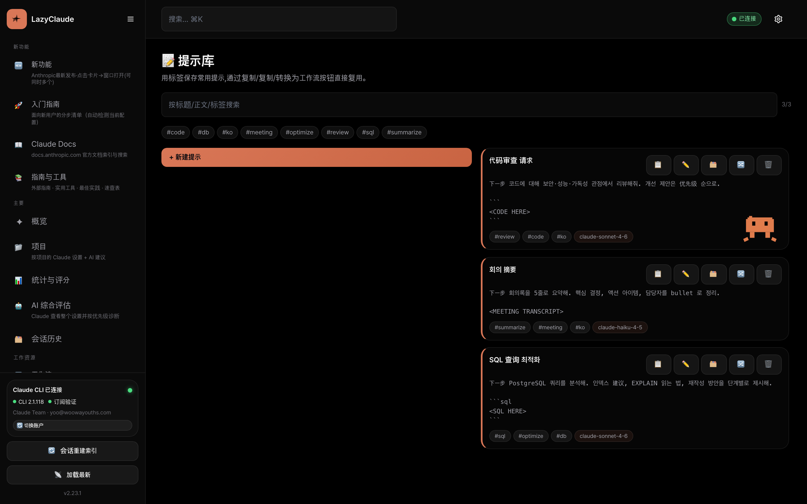 |
| 👥 项目子代理 | 🔗 MCP 连接器 |
| 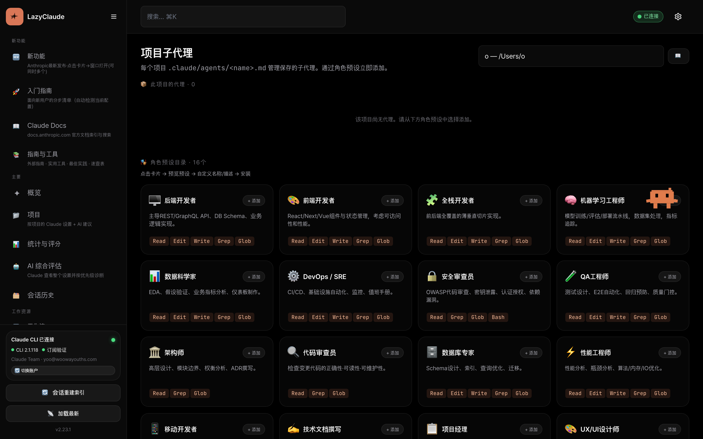 | 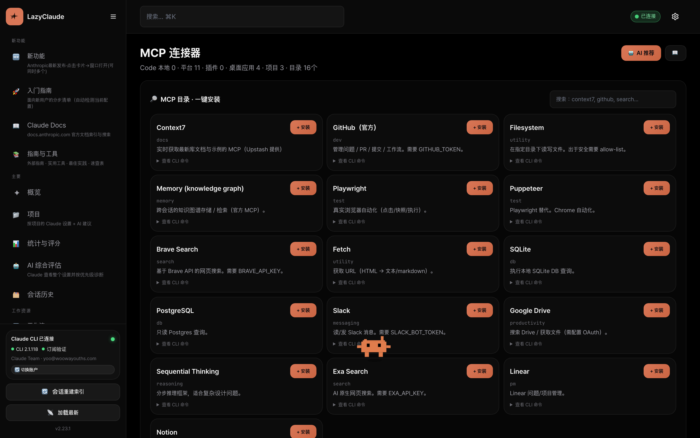 |

**Token 优化**

| 🦀 RTK 优化器（安装 · 激活 · 统计） |
|---|
| 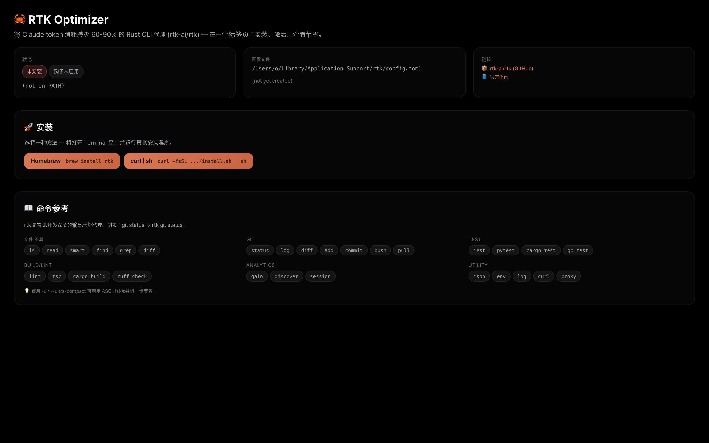 |

_所有截图由 `scripts/capture-screenshots.mjs`（Playwright · 1440×900 @2x）自动生成。UI 变更后请重新生成。_

---

## ✨ 为什么做这个项目？

如果你已经在使用 Claude Code，当你添加更多工具（GPT、Gemini、Ollama、Codex）时，就得自己管理一堆 CLI、API 密钥、回退逻辑和成本追踪。而 Claude Code 的配置目录（`~/.claude/`）会不断积累代理、技能、钩子、插件、MCP 服务器和会话，却没有一个统一视图。

**LazyClaude 在一个标签页内解决了这两个问题。**

| 以前 | 使用 Control Center |
|---|---|
| `cat ~/.claude/settings.json` 肉眼检查 | 52 个标签页各自渲染对应切片 |
| `ls ~/.claude/agents/` → 打开编辑器 | 16 种角色预设 · 一键创建 |
| 用 shell 脚本做多 AI 比较 | 拖 3 个 session 节点 → merge → output |
| 手动搭建 RAG 流水线 | 内置 `RAG Pipeline` 模板 |
| API 成本如黑盒 | 按供应商 / 日 的堆叠图表 |
| 中英文切换靠人脑 | 运行时 `ko` / `en` / `zh` 切换 |

---

## 🎯 使用场景

**个人开发者** — 在一处管理 Claude Code 配置（代理·技能·斜杠命令·MCP·会话）。从 16 种角色预设一键生成子代理。

**团队负责人** — 构建 `Lead → Frontend + Backend + Reviewer` 并行工作流。生成真实 Terminal 会话、按 `session_id` 续接、自动注入反馈笔记、按 N 个 sprint 循环执行。

**AI 研究者** — 将同一提示并行发送到 Claude + GPT + Gemini，合并结果，自动保存对比。或用 `embedding → 向量搜索（HTTP） → Claude` 五次拖拽搭出 RAG 流水线。

**自动化工程师** — 通过 Webhook（`POST /api/workflows/webhook/{id}`）从 GitHub Actions / Zapier 触发。用 Cron 每日自动执行。失败重试、回退到低价供应商、token 预算超标时告警。

**Ollama 高级用户** — 浏览 23 个模型目录，一键下载，用 Modelfile 创建自定义模型，选择默认聊天 / 嵌入模型——无需再记忆 `ollama pull` 命令。

---

## 🚀 快速开始（30 秒）

**1 · 克隆**
```bash
git clone https://github.com/cmblir/LazyClaude.git && cd LazyClaude
```

**2 · 运行**
```bash
python3 server.py
```

**3 · 打开**
→ [http://127.0.0.1:8080](http://127.0.0.1:8080)

就这样。无需 `pip install`、`npm install` 或 Docker。服务器仅使用 Python 标准库。

### 先决条件

| 必需 | 推荐 | 可选 |
|---|---|---|
| Python 3.10+ | Claude Code CLI — `npm i -g @anthropic-ai/claude-code` | Ollama（自动启动） |
| — | macOS（用于 Terminal.app 会话生成） | GPT / Gemini / Anthropic API 密钥 |

### 环境变量

```bash
HOST=127.0.0.1                       # 绑定地址（默认）
PORT=8080                            # 端口（默认）
CHAT_MODEL=haiku                     # 聊天机器人模型：haiku（默认） / sonnet / opus
OLLAMA_HOST=http://localhost:11434   # Ollama 服务器
OPENAI_API_KEY=sk-...                # 可选，也可在 UI 中设置
GEMINI_API_KEY=AIza...               # 可选
ANTHROPIC_API_KEY=sk-...             # 可选
```

API 密钥也可以在 `🧠 AI 供应商` 标签页中保存 — 存储于 `~/.claude-dashboard-config.json`。

---

## ✨ 核心功能

### 🔀 工作流引擎（n8n 风格 DAG）

- **16 种节点类型**：`start` · `session` · `subagent` · `aggregate` · `branch` · `output` · `http` · `transform` · `variable` · `subworkflow` · `embedding` · `loop` · `retry` · `error_handler` · `merge` · `delay`
- **并行执行** — 拓扑分层 + ThreadPoolExecutor
- **SSE 流式** — 节点级实时进度
- **🔁 Repeat** — 最大次数 · 间隔 · 调度窗口（`HH:MM~HH:MM`）· 反馈笔记自动注入
- **Cron 调度器** — 5 字段 cron 表达式，分钟级精度
- **Webhook 触发** — `POST /api/workflows/webhook/{wfId}` + `X-Webhook-Secret` 标头（v2.23 起强制 · 可在编辑器发放/更换/清除）
- **Export / Import** — 以 JSON 共享工作流
- **版本历史** — 自动保留最近 20 个版本 + 一键恢复
- **条件执行** — 11 种（contains · equals · regex · length · 带 AND/OR 的 expression ...）
- **变量作用域** — `{{变量名}}` 模板替换，全局或本地
- **8 个模板** — 5 个内置（多 AI 比较 · RAG · 代码审查 · 数据 ETL · 重试）+ 3 个团队启动（Lead/FE/BE · 研究 · 并行×3）+ 无限自定义
- **画布 UX** — 小地图 · 节点搜索（高亮+dim）· 分组（Shift+点击）· Ctrl+C/V/Z · `?` 快捷键帮助
- **18 幕交互式教程** — typewriter + 光标动画

### 🧠 多 AI 供应商

- **8 个内置** — Claude CLI · Ollama · Gemini CLI · Codex + OpenAI API · Gemini API · Anthropic API · Ollama API
- **自定义 CLI 供应商** — 将任意 CLI 注册为供应商（chat + embed 命令）
- **回退链** — 失败时自动切换（默认：`claude-cli → anthropic-api → openai-api → gemini-api`）
- **速率限制器** — 每供应商令牌桶（requests/min）
- **多 AI 比较** — 同一提示、多个供应商、结果并列
- **设置向导** — 新手三步引导（选择 → 配置 → 测试）
- **健康仪表板** — 每供应商实时可用性
- **成本追踪** — 按供应商 / 工作流 / 日的堆叠柱状图
- **使用量告警** — 可配置的每日 token / 成本阈值 → 浏览器通知

### 🦙 Ollama 模型中心（Open WebUI 风格）

- **23 个模型目录** — LLM · Code · Embedding · Vision 四个类别（llama3.1、qwen2.5、gemma2、deepseek-r1、bge-m3 等）
- **一键拉取** — 进度条（SSE 轮询）+ 删除 + 模型详情
- **自动启动** — 仪表板启动时自动运行 `ollama serve`
- **默认模型选择** — 每供应商聊天 / 嵌入默认值
- **Modelfile 编辑器** — 在 UI 中创建自定义模型

### 🦀 RTK 优化器 — 将 Claude token 削减 60-90%（v2.24.0）

集成 [`rtk-ai/rtk`](https://github.com/rtk-ai/rtk)，一款在命令输出到达 LLM 之前对其进行压缩的 Rust CLI 代理（官方基准中一个中等规模的 TS/Rust 会话从 118K → 24K token）。

- **一键安装** — Homebrew / `curl | sh` / Cargo，在 Terminal 窗口中交互执行
- **Claude Code 钩子激活** — 在仪表板中运行 `rtk init -g`，Bash 命令（如 `git status`）自动包装为 `rtk git status`
- **实时节省数据** — `rtk gain`（累计）+ `rtk session`（当前会话）以卡片渲染，支持手动刷新
- **配置文件查看器** — `~/Library/Application Support/rtk/config.toml`（macOS）/ `~/.config/rtk/config.toml`（Linux）
- **命令参考** — 30+ 子命令按 6 个分类（文件 · Git · Test · Build/Lint · Analytics · Utility）分组 + `-u/--ultra-compact` 提示

### 🤝 Claude Code 集成（53 个标签页）

| 分组 | 标签页 |
|---|---|
| 🆕 新功能 | `features` · `onboarding` · `guideHub` · 🆕 `claudeDocs` |
| 🏠 主要 | `overview` · `projects` · `analytics` · `aiEval` · `sessions` |
| 🛠️ 工作 | `workflows` · `aiProviders` · `agents` · `projectAgents` · `skills` · `commands` · `promptCache` · `thinkingLab` · `toolUseLab` · `batchJobs` · `apiFiles` · `visionLab` · `modelBench` · `serverTools` · `citationsLab` · `agentSdkScaffold` · `embeddingLab` · `promptLibrary` · 🆕 `rtk` |
| ⚙️ 配置 | `hooks` · `permissions` · `mcp` · `plugins` · `settings` · `claudemd` |
| 🎛️ 高级 | `outputStyles` · `statusline` · `plans` · `envConfig` · `modelConfig` · `ideStatus` · `marketplaces` · `scheduled` |
| 📈 系统 | `usage` · `metrics` · `memory` · `tasks` · `backups` · `bashHistory` · `telemetry` · `homunculus` · `team` · `system` |

亮点：**16 种子代理角色预设**、带质量评分的会话时间线、CLAUDE.md 编辑器、MCP 连接器安装器、插件市场。**Claude API 实验室 10 标签** — 提示缓存 · Extended Thinking · Tool Use · Batch · Files · Vision/PDF · 模型基准 · **hosted server tools (web_search + code_execution)** · **Citations** · **Agent SDK 脚手架**。**Docs Hub** — 33 页官方文档索引 + 仪表板标签页关联。

### 🌍 多语言支持

- **3 种语言** — 韩语（`ko`，默认）· 英语（`en`）· 中文（`zh`）
- **每种语言 3,234 个翻译键** · **英文/中文模式下韩文残留为 0**（已验证）
- **运行时 DOM 翻译** — 基于 MutationObserver（无需刷新页面）
- **`error_key` 系统** — 后端错误消息在前端本地化
- **校验流水线** — `scripts/verify-translations.js` 执行四项检查（parity · `t()` 调用 · audit · static DOM）

### 🎨 UX 与无障碍

- **5 种主题** — Dark · Light · Midnight · Forest · Sunset
- **移动端响应** — 可折叠侧边栏、全屏模态
- **无障碍** — ARIA 标签、`role="dialog"`、焦点陷阱、键盘导航
- **浏览器通知** — 工作流完成、使用量告警、系统事件
- **性能优化** — API 缓存、防抖自动刷新、RAF 批处理

---

## 📐 架构

```
claude-dashboard/
├── server.py                     # 入口（端口冲突自动解决 + ollama 自动启动）
├── server/                       # 14,067 行 · 仅使用标准库
│   ├── routes.py                 # 143 个 API 路由（GET + POST + PUT + DELETE + regex webhook）
│   ├── workflows.py              # DAG 引擎 · 16 种节点执行 · Repeat · Cron · Webhook (2,296)
│   ├── ai_providers.py           # 8 个供应商 · 注册表 · 速率限制器 (1,723)
│   ├── ai_keys.py                # 密钥管理 · 自定义供应商 · 成本追踪 (734)
│   ├── ollama_hub.py             # 模型目录 · pull/delete/create · serve 管理 (606)
│   ├── nav_catalog.py            # 52 个标签页单一数据源 + i18n 描述
│   ├── features.py               # 功能发现 · AI 评估 · 推荐
│   ├── projects.py               # 项目浏览器 · 16 个子代理角色预设
│   ├── sessions.py               # 会话索引 · 质量评分 · 代理图谱
│   ├── system.py                 # usage · memory · tasks · metrics · backups · telemetry
│   ├── errors.py                 # i18n 错误键系统（49 个键）
│   └── …                         # 共 20 个模块
├── dist/
│   ├── index.html                # 单文件 SPA（~13,500 行）
│   └── locales/{ko,en,zh}.json   # 3,234 键 × 3 语言
├── tools/
│   ├── translations_manual_*.py  # 手动翻译覆盖
│   ├── extract_ko_strings.py     # 韩文字符串提取器
│   ├── build_locales.py          # ko/en/zh JSON 构建器
│   └── i18n_audit.mjs            # Node 端审计
├── scripts/
│   ├── verify-translations.js    # 四阶段 i18n 校验
│   └── translate-refresh.sh      # 一键流水线
├── VERSION · CHANGELOG.md
└── README.md · README.ko.md · README.zh.md
```

### 数据存储（均在 `$HOME`，可通过 env var 覆盖）

| 文件 | 内容 |
|---|---|
| `~/.claude-dashboard-workflows.json` | 工作流 + 执行记录 + 自定义模板 + 版本历史 + 成本 |
| `~/.claude-dashboard-config.json` | API 密钥 · 自定义供应商 · 默认模型 · 回退链 · 使用量阈值 |
| `~/.claude-dashboard-translations.json` | AI 翻译缓存 |
| `~/.claude-dashboard.db` | SQLite 会话索引 |
| `~/.claude-dashboard-mcp-cache.json` | MCP 目录缓存 |
| `~/.claude-dashboard-ai-evaluation.json` | AI 评估缓存 |

原子写入：`server/utils.py::_safe_write`（`.tmp → rename`），并发安全使用 threading lock。

### 技术栈

| 层 | 技术 |
|---|---|
| 后端 | Python 标准库 `ThreadingHTTPServer`（零依赖） |
| 数据库 | SQLite WAL 模式 |
| 前端 | 单 HTML + Tailwind CDN + Chart.js + vis-network |
| i18n | 运行时 JSON fetch + MutationObserver DOM 翻译 |
| 工作流 | 拓扑 DAG 排序 + `concurrent.futures.ThreadPoolExecutor` |
| 聊天机器人 | 动态系统提示（每次请求读取 VERSION + CHANGELOG + nav_catalog） |

---

## 🔢 统计（v2.33.2）

| 指标 | 值 |
|---|---|
| 后端代码 | ~18,000 行 · 46 个模块 · 仅标准库 |
| 前端代码 | ~16,600 行 · 单 HTML 文件 |
| API 路由 | **190**（GET 102 / POST 85 / PUT 3 + regex webhook） |
| 标签页 | **52**（6 组） |
| 工作流节点类型 | **16** |
| AI 供应商 | **8** 个内置 + 无限自定义 |
| Claude API 实验室标签 | **11**（提示缓存 · Extended Thinking · Tool Use · Batch · Files · Vision · 模型基准 · Server Tools · Citations · Agent SDK 脚手架 · Embedding Lab） |
| 提示库 | ✓（按标签搜索 + 转为工作流） |
| 批量费用保护 | ✓（每批次 USD / Token 限额） |
| 官方文档索引 | **33** 页 |
| Ollama 目录 | **23** 个模型 |
| 子代理角色预设 | **16** |
| 内置工作流模板 | **8**（内置 5 + 团队 3） |
| i18n 键 | **3,234** × 3 语言 · 缺失 0 |
| 主题 | **5** |
| 教程场景 | **18** |
| E2E 测试脚本 | **3**（tabs smoke · workflow · ui elements） |

---

## 🛠️ 故障排查

| 问题 | 解决方案 |
|---|---|
| 端口 8080 已被占用 | `PORT=8090 python3 server.py`（服务器也会询问是否关闭已有进程） |
| `claude` 命令未找到 | 安装 Claude Code CLI：`npm i -g @anthropic-ai/claude-code` |
| Ollama 连接失败 | 检查 `OLLAMA_HOST`（默认 `http://localhost:11434`），或让仪表板自动启动 |
| macOS 会话生成失败 | 在系统设置 → 隐私与安全性 → 自动化 中授予 Terminal 权限 |
| 英文模式仍显示韩文 | 运行 `scripts/translate-refresh.sh`（重建 locales + 校验） |
| 聊天机器人回答"不知道此功能" | 机器人会实时读取 `VERSION` + `CHANGELOG.md` + `nav_catalog.py` — 添加功能时请同步更新这三个文件 |

---

## 🎭 E2E 测试 (Playwright)

Playwright 已作为 devDependency 安装。首次使用需要安装浏览器：

```bash
npx playwright install chromium
```

在仪表板服务器运行中 (`python3 server.py`):

```bash
npm run test:e2e:smoke       # 52 个标签页 — 渲染失败 / console error 检测
npm run test:e2e:workflow    # 内置模板创建 → 运行 → 横幅观察
npm run test:e2e:headed      # 带浏览器窗口运行
TAB_ID=workflows npm run test:e2e:smoke   # 仅单个标签页
```

脚本: `scripts/e2e-*.mjs`。无额外依赖，直接对 `127.0.0.1:8080` 实时服务器测试。

---

## 🤝 贡献

LazyClaude 是单人维护的个人项目，但欢迎提交 Issue 和 PR：[github.com/cmblir/LazyClaude](https://github.com/cmblir/LazyClaude)。

小修复（错别字、i18n 缺失、明显 bug）可直接提 PR。大型功能或重构请先开 Issue，避免重复工作。

### 添加新标签页（7 步）

1. 在 `dist/index.html::NAV` 添加条目
2. 在 `dist/index.html` 中实现 `VIEWS.<id>` 渲染器
3. 在 `server/nav_catalog.py::TAB_CATALOG` 添加 `(id, group, desc, keywords)`
4. 在 `TAB_DESC_I18N` 添加 `en` / `zh` 描述
5. （如需要）在 `server/routes.py` 添加后端路由 + `server/` 下的模块
6. 在 `tools/translations_manual_9.py` 注册新 UI 字符串
7. 运行 `python3 tools/extract_ko_strings.py && (cd tools && python3 build_locales.py) && node scripts/verify-translations.js`

### 翻译贡献

参阅 [`TRANSLATION_CONTRIBUTING.md`](./TRANSLATION_CONTRIBUTING.md) 和 [`TRANSLATION_MIGRATION.md`](./TRANSLATION_MIGRATION.md)。所有 UI 字符串必须在 ko / en / zh 中存在；`verify-translations.js` 会拦截缺失键。

### 版本规则

- `MAJOR` — 工作流 / 架构破坏性变更
- `MINOR` — 新增标签页或重要功能（向后兼容）
- `PATCH` — Bug 修复、UI 微调、i18n 加强

每次功能变更时，`VERSION` + `CHANGELOG.md` + `git tag -a vX.Y.Z` 三者一并更新。

---

## 📝 许可证

[MIT](./LICENSE) — 个人和商业使用均免费。署名欢迎但非必需。

---

## 🙏 致谢

- [Anthropic Claude Code](https://claude.com/claude-code) — 本仪表板所围绕的 CLI
- [n8n](https://n8n.io) — 工作流编辑器灵感来源
- [Open WebUI](https://openwebui.com) — Ollama 模型中心灵感来源
- [lazygit](https://github.com/jesseduffield/lazygit) / [lazydocker](https://github.com/jesseduffield/lazydocker) — 给这个项目起名的 "lazy" 精神
- 所有为开源 LLM 生态做出贡献的人 🧠

<div align="center"><sub>为那些宁可点击也不愿打字的人，用 💤 制作。</sub></div>
